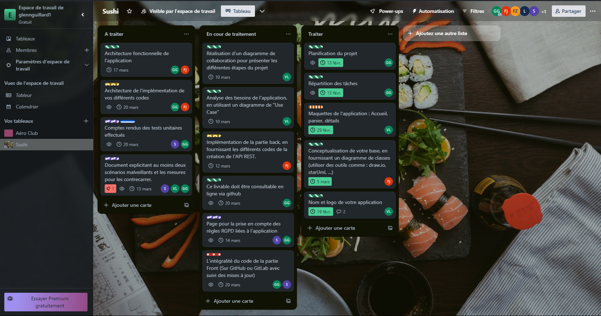
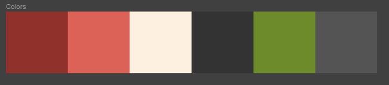
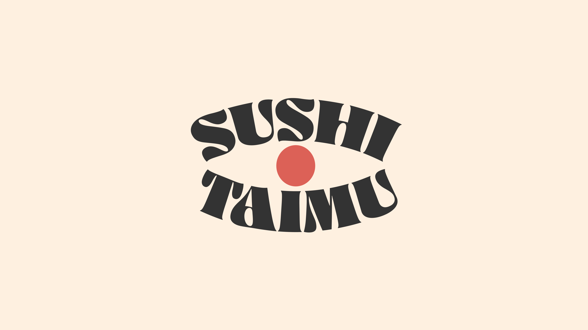
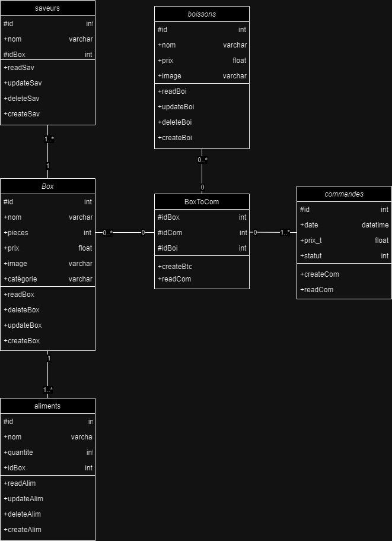

# Présentation

Ce projet a été lancé le 13 février 2024 dans le cadre d'un projet de SAE (Situation d'Apprentissage et d'Évaluation). L'objectif est de concevoir une application de commande de sushi, inspirée du style des bornes de commandes de McDonald's via une API REST.

Nous avons également reçu un [cahier des charges](documentation/CDC.pdf) pour respecter au mieux les critères de ce projet.

## Membres du groupe

### Glenn Guillard

Glenn Guillard est le chef de groupe. Il est chargé de veiller au respect des délais pour chaque livrable. De plus, il prend en charge la partie Front-end de l'application en collaboration avec Thomas Henry. Glenn est responsable du bon fonctionnement de l'application du côté Front-end.

### Jérôme Fabre

Jérôme Fabre est en charge du développement de l'API REST. À cette fin, il a créé un [GitHub](https://github.com/JeromeFabre77/Shushi-Taimu_REST-API_NodeJS) pour une gestion plus efficace de son API.

### Thomas Henry

Thomas Henry s'occupe également de la partie Front-end, plus spécifiquement de l'aspect esthétique du site (CSS), sous la direction de Valentin Lamour.

### Valentin Lamour

Enfin, Valentin Lamour est responsable du maquettage du site, ainsi que du choix du nom de l'application, des produits, etc.

# Gestion des livrables

La gestion des livrables est effectuée via Trello pour faciliter les modifications en cas de problème. Elle est supervisée par le chef de groupe, Glenn Guillard.

Lien du trello : [trello](https://trello.com/b/rNJzcP8y/sushi)

# Nom et Maquette

## Nom

Au tout début du projet, Valentin Lamour était chargé de trouver un nom pour cette application. Suite à plusieurs propositions, le nom "Sushi Taimu" a été adopté.

Ce nom a la signification suivante : "L'heure des sushis" (スシタイム).

## Maquette

### Palette de couleurs

Avant de commencer la maquette du site Sushi Taimu, Valentin Lamour a d'abord choisi une palette de couleurs afin de déterminer les couleurs qui seront utilisées sur le site. Il a donc sélectionné la palette de couleurs ci-dessus.

### Maquette

Par la suite, il a créé un fichier Figma afin de permettre l'accès aux autres membres du groupe.

Lien du Figma : [Figma](https://www.figma.com/file/gKZc007oUOffFvB1XhPsUc/Sushi-Taimu?type=design&node-id=0%3A1&mode=design&t=ze8ulIGCl7sPpjEc-1)

# API

## Conceptualisation de la base

Avant que Jérôme Fabre puisse commencer l'API, il a d'abord dû réaliser la conceptualisation de la base de données afin de définir le fonctionnement de la base et les interactions entre chaque table. Vous trouverez la conceptualisation de la base ci-dessus.

## API REST

Jérôme Fabre a choisi d'utiliser le framework Node.js avec le langage TypeScript afin de sortir de sa zone de confort. Il a donc dû apprendre tout le langage Node afin de réussir à créer l'API.
L'API est disponible sur le GitHub suivant : [GitHub](https://github.com/JeromeFabre77/Shushi-Taimu_REST-API_NodeJS)

# USE case & diagrame d'activité

## USE case

## diagrame d'activité

Valentin Lamour s'est occupé de réaliser le cas d'utilisation ainsi que le diagramme d'activité de cette SAE, qu'il avait déjà fait lorsqu'il était au lycée.
Le use case et le diagrame d'activité sont disponible sur [FigJam](https://www.figma.com/file/jdlV5JjdfUuJKkB8ys68Qw/Diagramme?type=whiteboard&node-id=0-1&t=mMWREuG7R7GUgmKT-0)

# Architecture fonctionnelle et des différents codes

## Architecture fonctionnelle

## Architecture des différents codes

Glenn Guillard s'est occupé de créer l'architecture fonctionnelle ainsi que l'architecture des différents codes.
Ces deux architectures sont disponibles sur le [FigJam](https://www.figma.com/file/GwrtXbRim8uxyCA61L570m/Architecture?type=whiteboard&node-id=0%3A1&t=MEeJ7FTShM4SAOQU-1).

# Scénarios malveillants et mesures pour les contrecarrer

Ces scénarios ont été rédigés par Thomas Henry dans le but de mettre en évidence certaines failles que des personnes malveillantes pourraient exploiter. De plus, des mesures ont été prises pour garantir la sécurité du site.
Lien du [Google doc](https://docs.google.com/document/d/1cn9JOwKrNjFW9-s0_Sc5ZqXu5CGTGibhUwCCUrN_Soc/edit?usp=sharing)

# Administration

La partie administration du site à été fait par Thomas Henry. Il a été fait en php. Il est disponible sur le [GitHub](https://github.com/S4m0htTT/Sushi-Taimu-Admin)

# Tests unitaires (bonus)

Les tests unitaires ont été réalisés par Glenn Guillard. Pour ce faire, il a créé des tests dans les fichiers spec du service Panier, qui est le service principal de l'application.
Lien du [Google doc](https://docs.google.com/document/d/1ON3YsklWcig6yD-eJX_JGFZqtNWLkjDzZdRp5eSQcjE/edit?usp=sharing)

_Ecrit par: Glenn Guillard le 23/02/2024_
